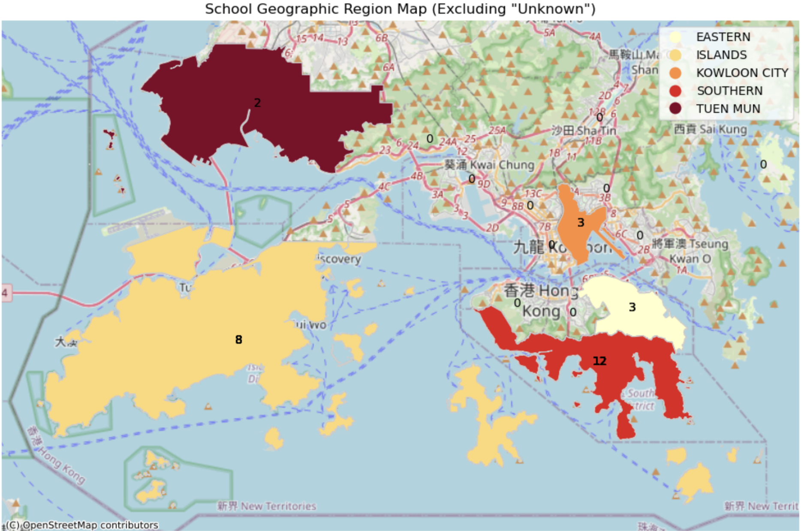

# Basketball Academy Data Analysis Report README

## Overview

Welcome to the Basketball Camp Data Analytics Project!

This project serves as a showcase of my data analytics and data science skills, focusing on extracting valuable insights from the data collected from our customers at the basketball camp. The primary goal of this project is to demonstrate my proficiency in handling and analyzing real-world data to derive meaningful conclusions and actionable insights.

One unique aspect of this project is the deliberate introduction of dirty data, intentionally included to highlight my expertise in data cleaning and manipulation using Pandas. By working with imperfect data, I aim to showcase my ability to preprocess and transform datasets effectively.

Through this project, I aim to not only reveal interesting patterns and trends within the basketball camp data but also demonstrate my capability to tackle data challenges and extract valuable information that can drive informed decision-making.
## Table of Contents
- [Introduction](#introduction)
- [Methodology](#methodology)
- [Data Overview](#data-overview)
- [Data Cleaning and Preprocessing](#data-cleaning-and-preprocessing)
- [Exploratory Data Analysis (EDA)](#exploratory-data-analysis-eda)
- [Key Findings](#key-findings)
- [Data Visualizations](#data-visualizations)
- [Recommendations](#recommendations)
- [Limitations](#limitations)
- [Conclusion](#conclusion)

## Introduction

Company X, a basketball academy in Hong Kong, collects data on camp attendees to understand their demographics and behaviors. This report aims to explore this dataset to drive business insights and improvements.

## Methodology

Explain the data sources, collection methods, tools, and techniques used for analysis.

The dataset is from a camp in Hong Kong. The analysis includes demographic visualizations, customer turnout rates, attendance patterns, correlations, and a Hong Kong district heatmap that visualizes where our kids attend school. Insights will be used to inform business decisions.

### Data Overview
The dataset comprises information related to student registrations for a series of events from August 19 to August 23, 2024. Each entry includes details such as timestamps of when students signed up on the google form, student IDs, event attendance flags for each day, payment status, jersey sizes, payment dates, dates of birth, age, gender, school attended, payment acknowledgment, injury liability waiver, and photograph release agreement.

```
Basketball_Academy/
├── data/
│   ├── HK_District/
│   │   ├── HKDistrict18.cpg
│   │   ├── HKDistrict18.dbf
│   │   ├── HKDistrict18.prj
│   │   ├── HKDistrict18.shp
│   │   ├── HKDistrict18.shp.xml
│   │   └── HKDistrict18.shx
│   ├── Additional_Columns.csv
│   ├── Anonymized_Data.csv
│   ├── Cleaned_Data.csv
│   ├── merged_df.csv
│   └── Raw_Camp_Data.csv
├── Anonymize.ipynb
├── Data_Cleaning.ipynb
├── Old_and_new.ipynb
├── Analysis & Insights.ipynb
├── README.md
└── utils.py
```
# Column Names: Basketball_Academy/data 

## merged_df 

- **Timestamp:** Date and time of registration (datetime)
- **Student ID:** Unique identifier for each student (string)
- **Aug 19 - Aug 23:** Attendance status for each event day (boolean)
- **Payment Received:** The total amount paid by student (integer)
- **Jersey Sizes:** Sizes chosen for jerseys (integer)
- **Payment Date:** Date payment was made (datetime)
- **Date of Birth:** Birthdate of the student (datetime)
- **Age:** Age of the student at the time of registration (integer)
- **Gender:** Gender of the student (string)
- **School:** School where the student is enrolled (string)
- **Payment Instruction Acknowledgement:** Acknowledgement of payment instructions (boolean)
- **Injury Liability Waiver:** Agreement to waive liability for injuries (boolean)
- **Photograph Release Agreement:** Agreement for photograph release (boolean)


## Additional_Columns 

- **Student ID:** Unique identifier for each student (string)
- **Returning Customer:** Indicates if the student is a returning customer (boolean)
- **Elite Team Status:** Indicates if the student is part of the elite team (boolean)
- **Weekend Academy Status:** Indicates if the student is part of the weekend academy (boolean)
- **School Geographic Region:** Geographic region of the school attended by the student (string)


_This dataset provides a comprehensive view of student registrations, payment statuses, and participant details for the specified events, allowing for further analysis and insights into attendance patterns, demographic information, and compliance with payment and liability agreements._

## Data Cleaning and Preprocessing

The original dataset came with many issues to fix. These were the issues and fixes:

**Anonymized Names**
- Protect identities by replacing names with unique identifiers like Student ID's to ensure data privacy.

**Removing Sensitive Information**
- Enhance data security by identifying and eliminating confidential data, such as personal identifiers like email addresses,and contact number.

**Column Name Mapping**
- Ensure clarity and consistency by aligning column headers to a standardized format for improved data understanding and analysis.

**Data Correction and Completion**
- Improve data quality by rectifying errors, addressing inconsistencies, and filling missing values to ensure accurate and complete datasets.

**Standardizing School Names**
- Enhance data uniformity by standardizing the naming format of educational institutions, resolving variations for easier comparison and analysis.

**Converting Data Types**
- Enhance data consistency by converting data formats to a standardized type, facilitating compatibility and analysis across different systems.

**Merging Datasets**
- Consolidate information from multiple sources by merging datasets based on common identifiers, enabling comprehensive analysis and insights derived from integrated data sets.

## Exploratory Data Analysis (EDA)
Patterns, trends, and relationships within the data will be explored.

## Key Findings
Important insights and discoveries from the analysis will be summarized.

- We retain a high amount of Elite Team players (94.74%)
- A little more than half are returning customers (61.29%)
- Most of our student's schools are based in the southern reigon (42.85%)
- Most of our student's attend HKIS and CDNIS
- Non ESF Schools were overwhelmingly prevalent in our camps.
- Customer Turnout was 8.82%.
- Weekend Academy Conversion Rate: 9.09%
- Elite Team Conversion Rate: 94.74%
- Returning Customer Conversion Rate: 61.29%
- People typically signed up on the day of the camp

## Data Visualizations

<div style="text-align:left;">
    
</div>


## Recommendations
1. Retention Strategies:
Elite Team Players: Given the high retention rate (94.74%), focus on maintaining the quality of services and benefits provided to Elite Team players to sustain their loyalty and engagement.
Returning Customers: Implement targeted retention campaigns for returning customers (61.29%) to enhance their overall experience and encourage repeat participation.
2. Geographic Focus:
Southern Region Dominance: Consider expanding marketing efforts in the southern region (42.85%) to capitalize on the existing student base and attract more participants from this area.
3. School Partnerships:
HKIS and CDNIS: Strengthen partnerships with schools like HKIS and CDNIS, which are popular among participants, to increase enrollment and brand visibility within these communities. We have already started ASA programs with CDNIS, which will help us foster more future players for our elite teams.
4. Market Diversification:
Non-ESF Schools: Given the prevalence of students from non-ESF schools, explore opportunities to diversify the participant base by targeting a wider range of schools and educational institutions.
5. Customer Acquisition:
Turnout and Conversion Rates: Enhance marketing strategies to increase customer turnout (8.82%) and optimize conversion rates for Weekend Academy (9.09%), Elite Team (94.74%), and Returning Customers (61.29%).
6. Registration Optimization:
Registration Timing: Since most participants sign up on the day of the camp, streamline the registration process, offer incentives for early registration, and provide real-time updates to encourage timely sign-ups.
7. Data-Driven Decision Making:
Data Analysis: Continuously monitor and analyze camp data to identify trends, preferences, and areas for improvement, enabling data-driven decision-making and strategic planning.
8. Feedback and Engagement:
Participant Feedback: Collect feedback from participants to understand their needs, preferences, and suggestions for enhancing the camp experience, leading to increased satisfaction and retention.
9. Community Engagement:
Community Outreach: Engage with the local community, schools, and organizations to promote the camp, foster partnerships, and build a strong network of supporters and participants.
10. Continuous Improvement:
Iterative Enhancements: Implement a culture of continuous improvement by iterating on feedback, refining processes, and adapting strategies to meet the evolving needs of participants and stakeholders.
By implementing these recommendations and leveraging the insights from the provided statistics, the camp can enhance participant retention, customer acquisition, and overall success, leading to a more engaging and rewarding experience for both students and organizers.
## Limitations
Any constraints in the analysis that might affect the validity of the findings will be discussed.

## Conclusion
Main findings and their implications for the business will be summarized.


